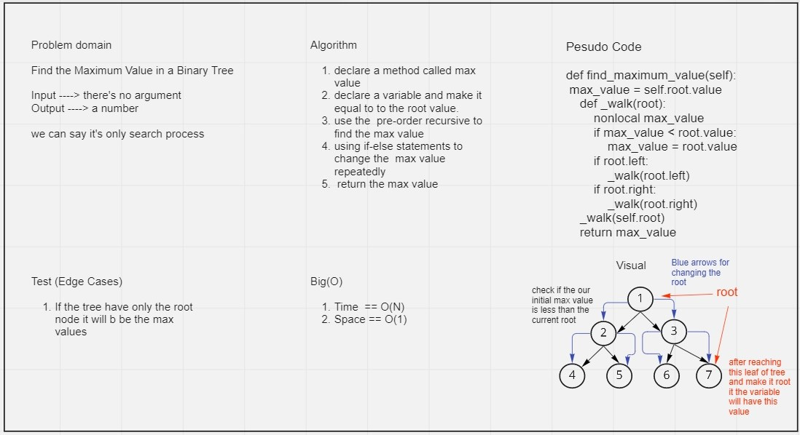

# Challenge16
Find the Maximum Value in a Binary Tree. Write the following method for the Binary Tree class:

find maximum value
Arguments: none
Returns: number

## Whiteboard Process

## Approach & Efficiency
We tried to keep our code as simple as possible to the best performance by reducing space/Time complexity so we end with the following

Big O:

Time complexity => O(N)
Space complexity => O(1)
we finish like this because it's searching proccess so as the node in tree increase it will need more time and the space will remain like this because we don't consume any space.

## Solution

[Code](../trees/trees.py) 
[Test](../tests/test_trees.py)
Algorithm

declare a method called max value
declare a variable and make it equal to the root value.
use the pre-order recursive to find the max value
using if-else statements to change the max value repeatedly
return the max value
The code the have test folder so you can run pytest amd there is an example in the code file you can run it and check the output.