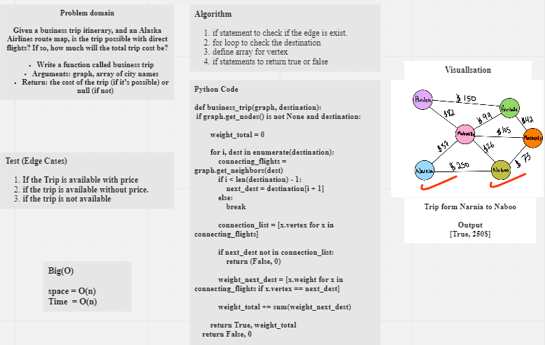

# Graphs

## Name: `graph_business_trip`
## Challenge Type: ` Code Challenge 37 `

## Graph business trip

## [Code](graph_business_trip.py)
## [tests](../tests/test_buss_graph.py)

## Challenge

Given a business trip itinerary, and an Alaska Airlines route map, is the trip possible with direct flights? If so, how much will the total trip cost be?

Write a function called business trip
Arguments: graph, array of city names
Return: the cost of the trip (if it’s possible) or null (if not)

## Whiteboard Process

## Approach & Efficiency
We tried to keep our code as simple as possible to the best performance by reducing space/Time complexity
so we end with the following

Big O:
1. Time complexity => O(N) 
2. Space complexity => O(N)
