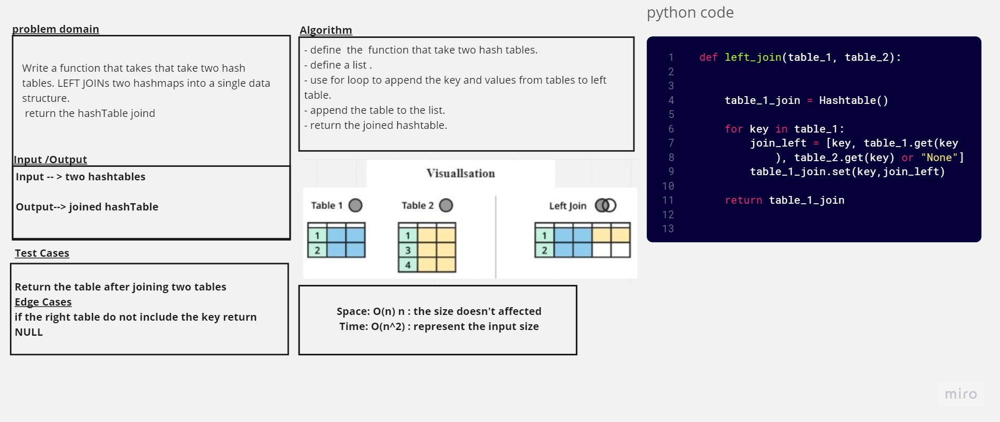

# HashTables

## Language: `Python`
## Challenge Type: ` Code Challenge / Algorithm`

## Challenge Left Join

## [Code](./hashmap_left_join.py)
## [tests](../tests/test_left_join.py)

## Challenge

Write a function that LEFT JOINs two hashmaps into a single data structure.

- Write a function called left join
- Arguments: two hash maps
- The first parameter is a hashmap that has word strings as keys, and a synonym of the key as values.
- The second parameter is a hashmap that has word strings as keys, and antonyms of the key as values.
- Return: The returned data structure that holds the results is up to you. It doesn’t need to exactly match the output below, so long as it achieves the LEFT JOIN logic
- Combine the key and corresponding values (if they exist) into a new data structure according to LEFT JOIN logic.
- LEFT JOIN means all the values in the first hashmap are returned, and if values exist in the “right” hashmap, they are appended to the result row.
- If no values exist in the right hashmap, then some flavor of NULL should be appended to the result row.

## Whiteboard Process

## Approach & Efficiency
We tried to keep our code as simple as possible to the best performance by reducing space/Time complexity
so we end with the following

Big O:
1. Space: O(n^2) 
2. Time: O(n) 

## Solution

- define  the  function that take two hash tables.
- define a list .
- use for loop to append the key and values from tables to left table.
- append the table to the list.
- return the list.
