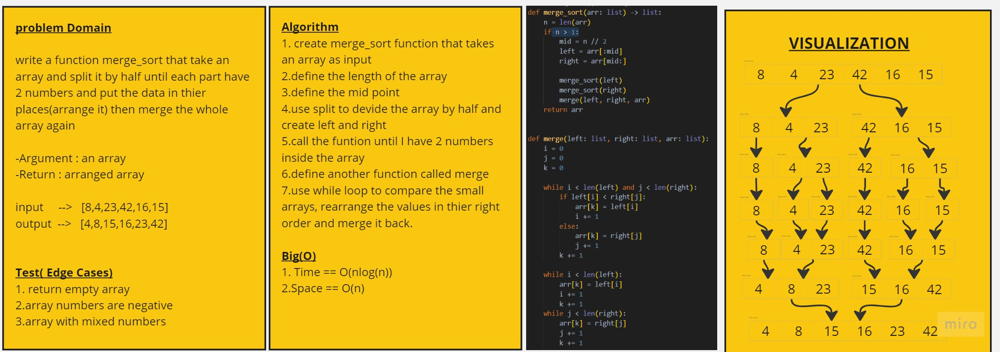

# Merge Sort.

## -Challenge 27:  Code Challenge / Tracing a Pseudocode 

## [Code in Python](./merge_sort.py)
## [tests](../tests/test_merge_sort.py)
## [Code Tracing](trace.md)

## -Assignment

Review the pseudocode below, then trace the algorithm by stepping through the process with the provided sample array. Document your explanation by creating a blog article that shows the step-by-step output after each iteration through some sort of visual.

Once you are done with your article, code a working, tested implementation of Merge Sort based on the pseudocode provided.

### --> Pseudocode

    ALGORITHM Mergesort(arr)
    DECLARE n <-- arr.length

    if n > 1
      DECLARE mid <-- n/2
      DECLARE left <-- arr[0...mid]
      DECLARE right <-- arr[mid...n]
      // sort the left side
      Mergesort(left)
      // sort the right side
      Mergesort(right)
      // merge the sorted left and right sides together
      Merge(left, right, arr)

    ALGORITHM Merge(left, right, arr)
    DECLARE i <-- 0
    DECLARE j <-- 0
    DECLARE k <-- 0

    while i < left.length && j < right.length
        if left[i] <= right[j]
            arr[k] <-- left[i]
            i <-- i + 1
        else
            arr[k] <-- right[j]
            j <-- j + 1

        k <-- k + 1

    if i = left.length
       set remaining entries in arr to remaining values in right
    else
       set remaining entries in arr to remaining values in left

## -Whiteboard Process

 

## -Approach & Efficiency

>Big(O)
>>- Time  == O(nlog(n))
>>- Space == O(n)
>>- **Note: you will find the description in the Trace**

## -Solution
- Algorithm
1. def merge_sort function which take  array as input.
2. define the length of array
3. define the mid point
4. using split to make left and right
5. call the function then return array
6. define another function called merge
7. using while loop to compare the small arrays, rearrange the values in their right order and merge it back.
