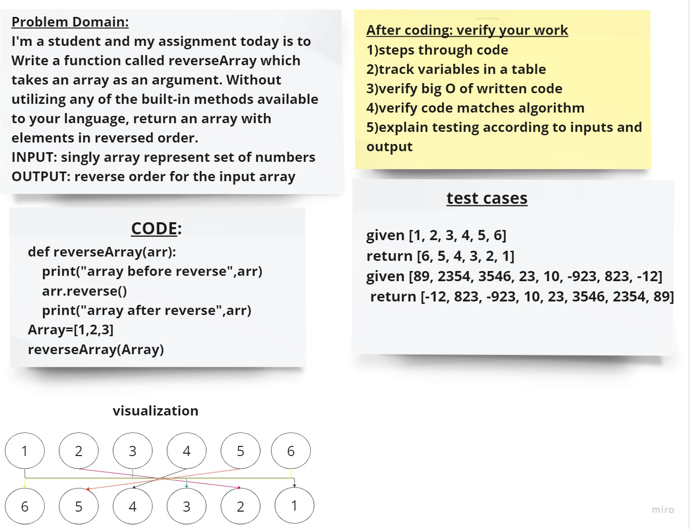

 # Challenge 1

__function called reverseArray which takes an array as an argument. Without utilizing any of the built-in methods available to your language, return an array with elements in reversed order.__

## Whiteboard Process

## Approach & Efficiency
I used the reverse() method,its the simplest way and workig efficency and matching the expected result

edited

also it takes a little lines of code

## Solution
python reverse_array.py

[link to code](reverce_array.py)
