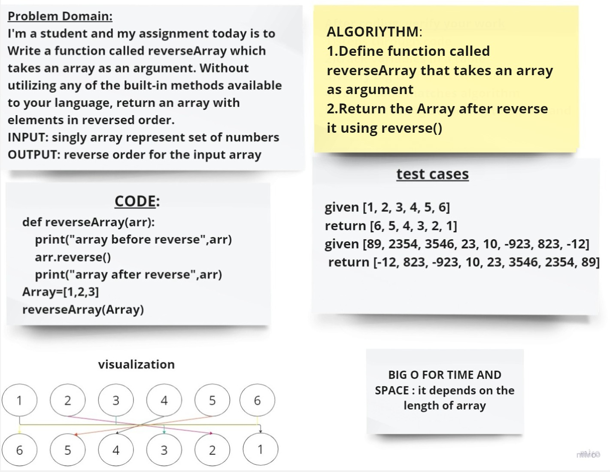

 # Challenge 1

__function called reverseArray which takes an array as an argument. Without utilizing any of the built-in methods available to your language, return an array with elements in reversed order.__

## Whiteboard Process

## Approach & Efficiency
<<<<<<< HEAD
- I used the reverse() method,its the simplest way and workig efficency and matching the expected result
=======
I used the reverse() method,its the simplest way and workig efficency and matching the expected result
 
 - The BIG O :
   - O(N) for both time and space.
   
>>>>>>> 05b07b10b7917b21304f1be5970049ce49580058
also it takes a little lines of code

- the BIG O :
 - O(N) for both Time and Space

## Solution
python reverse_array.py

[link to code](reverce_array.py)
